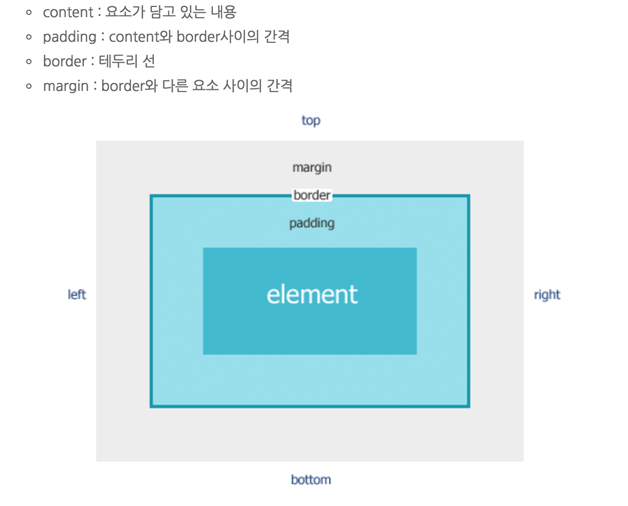
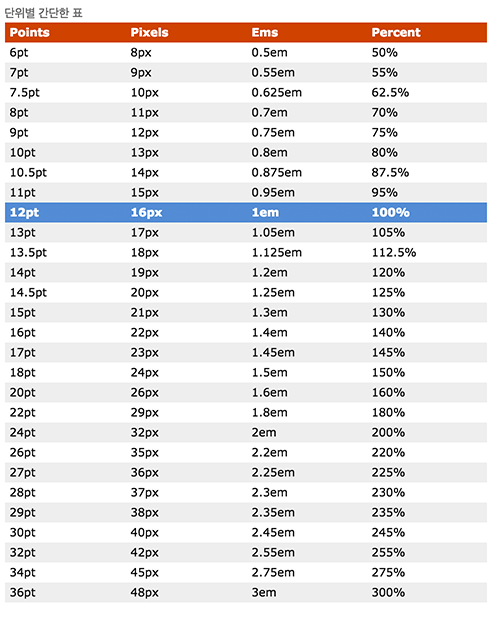

## CSS

[생활코딩 html 정보](https://opentutorials.org/module/552/4786)
[생활코딩 css 정보](https://opentutorials.org/module/441/3798)


#### 박스 구조

[생활코딩 박스구조 설명](https://opentutorials.org/module/441/3798)



##### border 계산 없이 안쪽으로 넣기 
box-sizing 
- content-box
- padding-box
- border-box
````
box-sizing:border-box
````

#### 말줄임
말줄임은 너비값이 정해져야됩니다. 

##### 한줄 처리 말줄임
````
overflow:hidden;
word-wrap:normal;
white-space:nowrap;
text-overflow:ellipsis;
````

##### 두줄 처리 말줄임 (IE하위 버전은 안됨)
````
overflow:hidden;
display: -webkit-box;
word-wrap:break-word;
text-overflow:ellipsis;
-webkit-line-clamp:3;   -- 라인수 지정
-webkit-box-orient:vertical;
 
웹킷 엔진을 사용하지 않는 브라우져를 위해 사용방법
line-height:1.2em;
height:3.6em;
````

#### float 해제

float를 쓸 경우 박스구조가 떠있는 상태가 되므로 해당 부모엘리먼트는 높이값을 못잡는다.
잡기 위해서는 float을 해제 시켜줘야된다.

##### 방법1
````
overflow:hidden;
 
float를 준 엘리먼트를 감싼 부모한테 주면된다. 사용에 따라 다르지만 해당 영역 밖에 있는 곳까지 보여야되는 효과를 줄려면 쓸 수가 없다.
````

##### 방법2
````
<div>
	<div style="float:left"></div>
	<div style="float:left"></div>
	<div style="clear:both"></div>
</div> 
하단에 태그 하나를 생성 후 스타일을 주는 방식. 잘안쓰는 방법이다.
````

##### 방법3
````
<style>
	.test:after{
		display:table;      -- block으로 주는 경우도있는데 검색해보면 table을 더 많이 사용한다.
		clear:both;
		content:'';
	}
</style>

<div class="test">
	<div style="float:left"></div>
	<div style="float:left"></div>
</div> 
가상으로 컨텐츠를 만들어 해제시키는 방법
````

#### background
background 에는 여러가지 속성이 있습니다.
background:url('주소') repeat값 position값
 
- background-color:#000; - background 색상 지정  
- background-image:url();   - background 이미지 불러옴
- background-position:0 0;  - 위치 설정
- background-repeat:repeat; - background 이미지를 연달아서 채울지 정하는 속성  (repeat-x, repeat-y, no-repeat)
- background-size:0 0; - background 이미지 사이즈를 조절한다. 
- background-attachment:fixed; - background를 해당 위치값 고정 시키므로써 화면상에 따라다니게한다. 
- background-clip : border-box, padding-box, content-box  - 백그라운드 영역 지정 ie9 이
 
#### Ratio
레티나 대응

````
@media only screen and (-webkit-min-device-pixel-ratio: 1.5), not all, only screen and (min-resolution: 1.5dppx), only screen and (min-resolution: 144dpi)
````

#### border

보더 값은 위,아래,오른쪽,왼쪽 따로 스타일을 지정할 수 있습니다.

ex)
````
border-bottom-color, border-bottom-style, border-bottom-width, border-bottom-right-radius
````

table에 필요한 보더 속성
````
border-collapse   - separate: 테이블 줄이 합쳐지지 않는 상태에서 노출, - collapse : 테이블에 겹쳐지는 줄이 합쳐진 상태 노출
````


#### css 단위
- em : font-size에 비례 하여 정의
- rem : 최상위의 폰트만 가지고 정의
- ex : 현재 폰트 문자 x의 높이값을 가지고 정의
- px
- pt
- %
- vw, vh : 넓이값과 높이값의 100분위 1단위




#### 미디어쿼리
모바일 경우 디바이스 가로값 마다 css 스타일이 달라지는 경우가 있다. 그럴때 미디어쿼리를 써서 해당되는 가로값부분만 적용 가능하다.
````
@media all and (min-width: 321px) and (max-width: 375px){}
````

### css3

#### transition
transition: all 2s ease-in-out 1s : 해당되는 property, 변형되는 시간, 효과, delay

transition-property, transition-duration, transition-timing-function, transition-delay 

````
div {
    width: 100px;
    height: 100px;
    background: red;
    transition: all 2s ease-in-out 1s;
    -webkit-transition: all 2s ease-in-out 1s; /* Safari 3.1 to 6.0 */
}
````

#### transform

##### 종류
- matrix(n,n,n,n,n)
- matrix3d(n,n,n,n,n,n,n,n,n,n,n,n,n,n,n,n)
- translate(x,y)
- translate3d(x,y,z)
- scale(x,y)
- scale3d(x,y,z)
- rotate(30deg)
- rotate3d(x,y,z,angle)
- skew(20deg,20deg)

````
div:hover {
    width: 300px;
    opacity:0.5;
    background:blue;
    -ms-transform: rotate(20deg); /* IE 9 */
    -webkit-transform: rotate(20deg); /* Safari 3-8 */
    transform: rotate(20deg);
}
````


#### animation
[animation-timing-function 속성](https://www.w3schools.com/cssref/css3_pr_animation-timing-function.asp)
  
animation: example 5s linear 2s infinite alternate;  - 속성 한번에 줄때

- animation-name: example - 애니메이션 이름
- animation-duration: 5s - 애니메이션 동작시간
- animation-timing-function: linear- 애니메이션 효과
- animation-delay: 2s - 애니메이션 delay시간
- animation-iteration-count: infinite - 애니메이션 반복여부  (animation-iteration-count:1)일 경우 한번 실행
- animation-direction: alternate - 애니메이션 역방향 여부
 (: normal - 정상방향
 : reverse - 역방향
 : alternate - 정상방향 된뒤에 역방향실행
 : alternate-reverse - 역방향 실행뒤 정상방향)


````
div {
    width: 100px;
    height: 100px;
    background: red;
    position: relative;
    -webkit-animation: mymove 5s infinite; /* Safari 4.0 - 8.0 */
    animation: mymove 5s infinite;
}
/* Safari 4.0 - 8.0 */
@-webkit-keyframes mymove {
    from {left: 0px;}
    to {left: 200px;}
}
@keyframes mymove {
    from {left: 0px;}
    to {left: 200px;}
}
````
````
div {
    width: 100px;
    height: 100px;
    background-color: red;
    position: relative;
    -webkit-animation-name: example; /* Safari 4.0 - 8.0 */
    -webkit-animation-duration: 4s; /* Safari 4.0 - 8.0 */
    -webkit-animation-direction: reverse; /* Safari 4.0 - 8.0 */
    animation-name: example;
    animation-duration: 4s;
    animation-direction: reverse;    
}
/* Safari 4.0 - 8.0 */
@-webkit-keyframes example {
    0%   {background-color:red; left:0px; top:0px;}
    25%  {background-color:yellow; left:200px; top:0px;}
    50%  {background-color:blue; left:200px; top:200px;}
    75%  {background-color:green; left:0px; top:200px;}
    100% {background-color:red; left:0px; top:0px;}
}
/* Standard syntax */
@keyframes example {
    0%   {background-color:red; left:0px; top:0px;}
    25%  {background-color:yellow; left:200px; top:0px;}
    50%  {background-color:blue; left:200px; top:200px;}
    75%  {background-color:green; left:0px; top:200px;}
    100% {background-color:red; left:0px; top:0px;}
}
````


